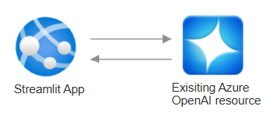

# GenAI Demos with streamlit

As someone familar with python a way to create quick demos with a functional UI



## Pre-req
- Azure subscription with contributor rights
- Previously deployed OpenAI / Foundry resource with gpt4o deployed.

## Local Configuration

### Environment Variables

Create a `.env` file in the root directory to configure model access. The file should include:

1. **Default model configuration** - Used when no specific model is selected
2. **Model-specific configurations** - Each model should have its own set of configurations

Example `.env` file:
```
# Default
DEFAULT_MODEL_NAME=gpt-4o
OPENAI_API_ENDPOINT=https://your-endpoint.openai.azure.com/openai/deployments/gpt-4o-mini/chat/completions?api-version=2025-01-01-preview
OPENAI_API_KEY=your-api-key-here

## Additional model configurations
# 4o
MODEL_4O_NAME=4o
MODEL_4O_ENDPOINT=https://your-endpoint.openai.azure.com/openai/deployments/gpt-4o/chat/completions?api-version=2025-01-01-preview
MODEL_4O_API_KEY=your-api-key-here
MODEL_4O_DEPLOYMENT_NAME=4o
MODEL_4O_API_VERSION=2025-01-01-preview
MODEL_4O_TOKEN_PARAM=max_tokens
MODEL_4O_UNSUPPORTED_PARAMS=

# o3 mini
MODEL_O3_MINI_NAME=o3-mini
MODEL_O3_MINI_ENDPOINT=https://your-endpoint.openai.azure.com/openai/deployments/o3-mini/chat/completions?api-version=2024-12-01-preview
MODEL_O3_MINI_API_KEY=your-api-key-here
MODEL_O3_MINI_DEPLOYMENT_NAME=o3-mini
MODEL_O3_MINI_API_VERSION=2024-12-01-preview
MODEL_O3_MINI_TOKEN_PARAM=max_completion_tokens
MODEL_O3_MINI_UNSUPPORTED_PARAMS=temperature
```

For each model, you need to define:
- `MODEL_{NAME}_NAME`: Display name of the model
- `MODEL_{NAME}_ENDPOINT`: Azure OpenAI endpoint URL
- `MODEL_{NAME}_API_KEY`: Your API key
- `MODEL_{NAME}_DEPLOYMENT_NAME`: Deployment name in Azure
- `MODEL_{NAME}_API_VERSION`: API version (e.g., "2025-01-01-preview")
- `MODEL_{NAME}_TOKEN_PARAM`: Parameter name for token limit (e.g., "max_tokens" or "max_completion_tokens")
- `MODEL_{NAME}_UNSUPPORTED_PARAMS`: Comma-separated list of parameters not supported by this model

Note: Replace placeholder values with your actual Azure OpenAI credentials.

## Usage

### Locally
1. Create a virtual environment
2. Install dependencies in requirements.txt
3. Run the command below to run strealit on localhost.
```bash
python -m streamlit run src/Home.py
```

### Deploy to cloud

1. Install AZD and clone the repo.

2. Create a main.bicepparam file from template

3. Add openai api key and endpoint from existing resource into param file.

- `Environment Name`: This will be used as a prefix for the resource group that will be created to hold all Azure resources. This name should be unique within your Azure subscription.

4. Run the following command to build a deployable copy of your application, provision the template's infrastructure to Azure and also deploy the application code to those newly provisioned resources.

```bash
azd up
```

This command will prompt you for the following information:
- `Azure Location`: The Azure location where your resources will be deployed.
- `Azure Subscription`: The Azure Subscription where your resources will be deployed.

> NOTE: This may take a while to complete as it executes three commands: `azd package` (builds a deployable copy of your application), `azd provision` (provisions Azure resources), and `azd deploy` (deploys application code). You will see a progress indicator as it packages, provisions and deploys your application.

3. If you want to change things make changes to stlitapp.py and run `azd deploy` again to update your changes.

## Notes

This uses the F1 (free) SKU for app service, which has limited CPU and RAM resources.

See the [pricing calculator](https://azure.microsoft.com/en-au/pricing/calculator/) for details on paid SKUs replace the SKU option with a suitable choice.

Based on the this [great template:](MiguelElGallo/simple-streamlit-azd)

Added support for `azd pipeline config`, enabling creation of CI/CD pipeline for GitHub Actions. Note this is still a [beta](https://learn.microsoft.com/en-us/azure/developer/azure-developer-cli/configure-devops-pipeline?tabs=GitHub) feature in AZD.